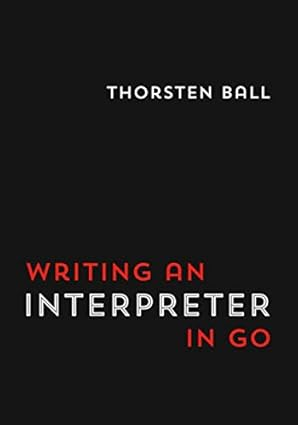
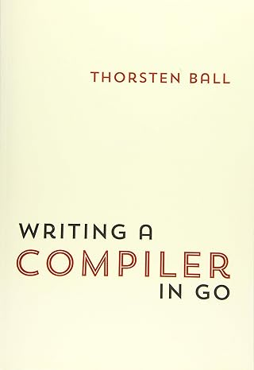

# Monkey language

This repository serves as my walkthrough of two books by Thornsten Ball:

- [Writing an Interpreter in Go](https://www.amazon.ca/dp/3982016118), and
- [Writing a Compiler in Go](https://www.amazon.ca/Writing-Compiler-Go-Thorsten-Ball/dp/398201610X)

I used them attending a corresponding course at the company that I work for, [Improving Ottawa](https://www.improving.com/locations/ottawa/?region=ca).

[](https://interpreterbook.com/)


## Usage

### Running Tests

To run the tests for the lexer, we would run:

```go
go test -v ./lexer
=== RUN   TestNextToken
--- PASS: TestNextToken (0.00s)
PASS
ok   monkey-lang/lexer 0.003s
```

In order to run all tests, you may just do `go test -v ./...`.

Finally, in order to run just one test from a test file, you may use the `-run` flag, followed by the name of the test function. For example, to run the `TestParsePrefixExpression` test from the `parser` package, you would run:

```go
go test -v ./parser -run TestParsePrefixExpression
=== RUN   TestParsePrefixExpression
--- PASS: TestParsePrefixExpression (0.00s)
PASS
ok   monkey-lang/parser 0.003s
```

### REPL

Monkey's language "Read Eval Print Loop" (REPL) may be run like such:

```go
go run main.go
```

## Development

### Code formatting

To format all files issue this command from repository root:

```bash
gofmt -w
```
